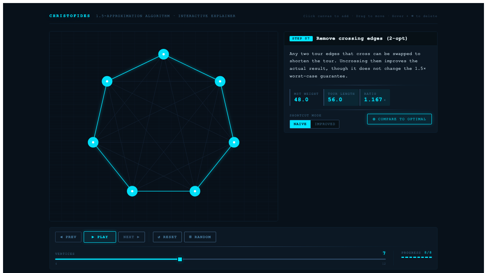
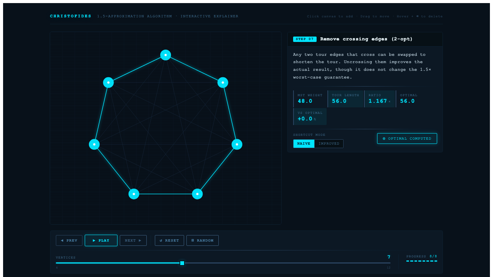

# Christofides Algorithm — Interactive Explainer

An interactive, step-by-step visual explainer of Christofides' algorithm for the Travelling Salesman Problem, guaranteed to find a tour within **1.5× of optimal** for metric TSP instances.

**Live demo:** _(deploy to Netlify — see below)_


---

## What is Christofides?

The Travelling Salesman Problem asks: given a set of cities, find the shortest round-trip that visits each city exactly once. It's NP-hard — brute-force requires checking O(n!) routes, making exact solutions impractical beyond ~15 cities.

Christofides' algorithm (1976) is a landmark result in approximation algorithms. For metric TSP — where distances satisfy the triangle inequality — it guarantees a Hamiltonian tour no more than **1.5× the length of the optimal tour**. No polynomial-time algorithm with a better worst-case ratio was known for nearly 50 years (until the 2020 Karlin–Klein–Gharan improvement, which shaves an infinitesimal epsilon off the bound).

This app makes the algorithm tangible by letting you watch it execute one step at a time on a graph you build yourself.

---

## The Algorithm, Step by Step

**Step 0 — Complete graph**
Build the complete weighted graph on your input vertices: every pair of cities is connected, with edge weights equal to Euclidean distance.

**Step 1 — Minimum Spanning Tree**
Run Kruskal's algorithm to find the MST. This gives a connected subgraph with minimum total edge weight — a lower bound on the optimal tour.


**Step 2 — Odd-degree vertices**
Identify all vertices with an odd number of MST edges. By the handshaking lemma, there is always an even number of such vertices.

**Step 3 — Induced subgraph**
Extract the complete subgraph induced by the odd-degree vertices — the input to the matching step.

**Step 4 — Minimum-weight perfect matching**
Find a minimum-weight perfect matching on the odd-degree vertices using Edmonds' blossom algorithm. This pairs up every odd-degree vertex to make all degrees even, at minimum additional cost.

**Step 5 — Union (multigraph)**
Combine the MST edges and the matching edges into a multigraph. Every vertex now has even degree, which is the condition required for an Eulerian circuit.

**Step 6 — Eulerian circuit**
Trace an Eulerian circuit through the multigraph — a closed walk that uses every edge exactly once.

**Step 7 — Christofides tour**
Convert the Eulerian circuit to a Hamiltonian tour by shortcutting repeated vertices (skipping any city already visited). The triangle inequality ensures shortcuts never increase tour length. Optionally apply 2-opt uncrossing to remove crossing edges.



The metrics panel shows MST weight, tour length, and the approximation ratio. In the screenshot above: MST 48, Tour 56, Ratio 1.167×.

---

## Features

**Interactive graph editing**
- Click empty space to add a vertex
- Drag vertices to reposition them
- Hover a vertex and press Backspace to delete it

**Playback controls**
- Step forward/backward through all 8 algorithm stages
- Play/pause for automatic stepping with configurable speed
- Randomize to generate a new random graph

**Live metrics**
MST weight, tour length, and approximation ratio update in real time as you edit the graph or step through stages.

**Naive vs improved shortcutting**
Toggle between naive shortcutting (take vertices in Eulerian order) and improved shortcutting (greedy insertion order) to see how much tour quality varies before 2-opt.

**Compare to brute-force optimal**
For graphs with 9 or fewer vertices, compute the provably optimal tour by exhaustive search and display the gap between Christofides' result and optimal.



---

## Architecture

The codebase is split into two layers with a clean boundary between them.

**Algorithm core (`src/algorithm/`)**
Pure TypeScript functions with no framework dependencies:
- `kruskal.ts` — MST construction
- `matching.ts` — wrapper around Edmonds' blossom matching
- `euler.ts` — Eulerian circuit via Hierholzer's algorithm
- `hamiltonian.ts` — shortcutting with naive and improved strategies
- `removeCrossings.ts` — 2-opt uncrossing
- `bruteForce.ts` — exhaustive optimal tour (guarded to ≤9 vertices)

Every function in `src/algorithm/` is covered by Vitest unit tests. The suite has **108 passing tests**.

**Presentation layer (`src/components/`, `src/hooks/`, `src/model/`)**
React 18 components rendering SVG directly — no canvas, no third-party graph library. `useChristofides` drives the step machine; `useGraphInteraction` handles pointer events. The model layer (`graphModel`, `metrics`, `steps`) bridges algorithm outputs to render state.

---

## Run Locally

```bash
npm install
npm run dev     # http://localhost:5173
npm test        # run the 108-test Vitest suite
npm run build   # production build → dist/
```

---

## Tech Stack

- **React 18** + **TypeScript** — UI and type safety
- **Vite** — dev server and production bundler
- **SVG** — all graph rendering, no canvas
- **Framer Motion** — step transitions and animations
- **Vitest** — unit tests for the algorithm core
- **Edmonds' blossom matching** — via [`edmonds-blossom`](https://github.com/joudinet/EdmondsBlossom)
- **Ramda** — functional utilities

---

## Deploy

The repo includes a `netlify.toml` configured for one-command deploys:

```toml
[build]
  command = "npm run build"
  publish = "dist"
```

Connect the repository in the Netlify dashboard, or deploy manually:

```bash
npx netlify deploy --build --prod
```

After the first deploy, paste the production URL into the live demo link at the top of this file.

---

## Author

Karl Rombauts — karlrombauts@gmail.com
